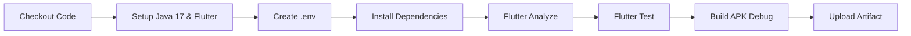

# ⚙️ CI/CD Workflows — Warehaus Mobile

Folder ini berisi otomatisasi **Continuous Integration & Continuous Delivery (CI/CD)** menggunakan **GitHub Actions** untuk proyek **Warehaus Mobile (Flutter)**.

---

## 📂 Daftar Workflow

### 1. `build-apk.yml` (CI/CD - Test & Build APK Develop)

Workflow ini bertugas menguji kode dan mengompilasi APK staging secara otomatis setiap ada pembaruan di branch `develop`.

#### ⚡ Triggers (Pemicu Pipeline):
- **`push`** ke branch `develop` *(saat PR di-merge ke develop)*.
- **`pull_request`** menuju branch `develop` *(untuk memvalidasi kode sebelum di-merge)*.
- **`workflow_dispatch`** *(tombol manual "Run workflow" di tab Actions GitHub)*.

#### 🔄 Tahapan Pipeline:

1. **Setup Environment**: Menyiapkan JDK 17 dan Flutter SDK Stable dengan caching dependency.
2. **Environment File (`.env`)**: Membaca Secret `ENV_FILE` dari GitHub Settings (atau fallback URL default jika belum ada).
3. **Quality Gate (Testing)**:
   - `flutter analyze --no-fatal-infos` (Mengecek error statis dan linter).
   - `flutter test` (Menjalankan seluruh unit & widget test).
4. **Build Android APK**: Mengompilasi APK versi testing (`app-debug.apk`).
5. **Artifact Upload**: Menyimpan file APK hasil build di GitHub Actions selama **14 hari**.

---

## 📥 Cara Mengunduh Hasil Build APK

Bagi QA, Tester, maupun Developer yang ingin mencoba aplikasi di HP tanpa build manual:

1. Buka tab **Actions** di repository GitHub: [GitHub Actions Tab](https://github.com/pens-pbl/warehaus-mobile/actions)
2. Klik workflow run terbaru yang berstatus **Success (Centang Hijau)** pada branch `develop`.
3. Scroll ke bagian paling bawah (bagian **Artifacts**).
4. Klik **`warehaus-mobile-develop-apk`** untuk mengunduh file zip yang berisi APK aplikasi.

---

## 🔒 Catatan untuk Admin Repository

Jika Anda memiliki akses Administrator pada repository GitHub ini, disarankan mengaktifkan **Branch Protection Rules** dari server:

1. Buka **Settings** > **Branches** > **Add branch protection rule**.
2. **Branch name pattern**: `develop`
3. Centang:
   - `Require a pull request before merging`
   - `Require status checks to pass before merging` (Pilih check: `Test & Build Android APK`)
   - `Do not allow bypassing the above settings`
4. Klik **Save changes**.
